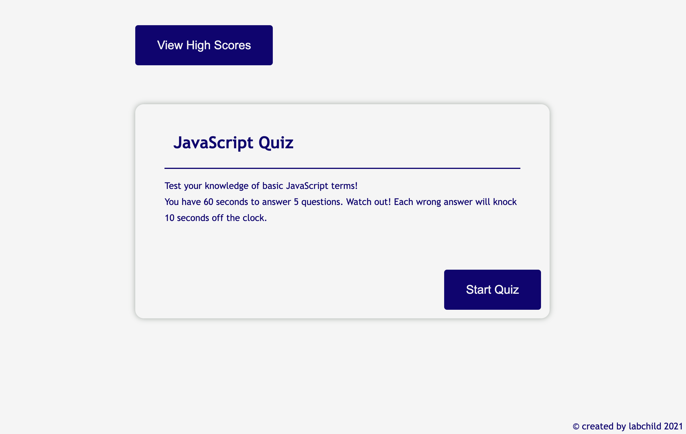

# js quiz
A web quiz on JavaScript terms.

## Description
A timed quiz to test knowledge of basic JavaScript knowledge. The quiz is contained on a single HTML document and does not need to be refreshed.

### Key Features
* Quiz & score elements are dynamically generated
* Scores can be saved to local storage
* Saved score list can be called either before or after quiz

## Built With
* JavaScript
* HTML
* CSS

## Download and View
Check out the quiz at
You can download the repo and check out my code at

## Author & Acknowledgements
Written and deployed by Lelah Bates Childs.
Thank you to my bootcamp instructional team and cohort, for helping me along this journey to become a developer.

### Want to Help?
Do you see something I missed or a more succint and effective way this code can be written? Great! Please reach out and let me know how I can improve.

You can find me on GitHub (@labchild) or email me (labchilds@gmail.com). Thanks in advance for your tips, tricks, and pointers!